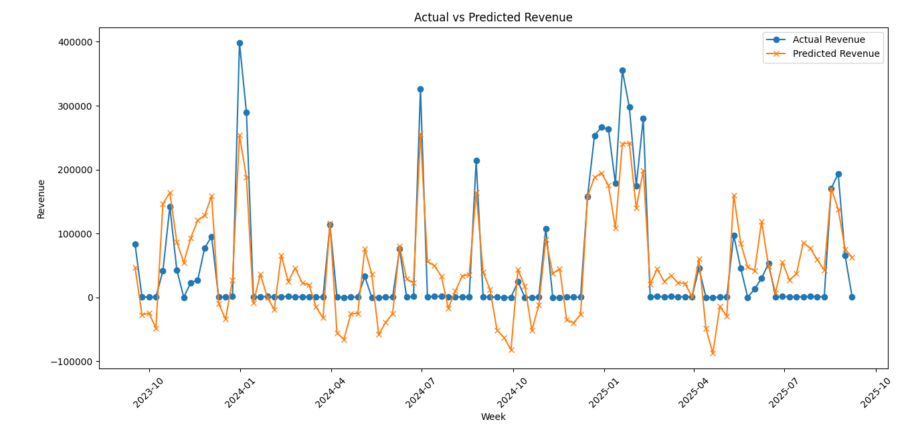

# Marketing-Mix-Modeling

## Overview
This project demonstrates an end-to-end Marketing Mix Modeling pipeline with a mediation assumption, analyzing the influence of various marketing channels, promotions, pricing, and direct response levers on revenue using a two-year weekly dataset.

## System & Environment
- **OS:** Microsoft Windows [Version 10.0.26100.4946]
- **Python Version:** 3.13.1
- **Virtual Environment:** `venv`

### Setup Steps
```bash
cd C:\Users\trees\marketing_modelling   # Navigate to the project folder
python -m venv venv                        # Create virtual environment
venv\Scripts\activate                     # Activate virtual environment
pip install -r requirements.txt            # Install dependencies
```
## Running the Project
Once the code files are created, verification of whether the code is working or not can be verified by typing 'python', so that python shell will be opened. 
```python
python
>>> from src.data_prep import load_data, preprocess
>>> from src.mediator import stage1_google_model
>>> from src.modeling import train_revenue_model
>>> from src.evaluation import plot_predictions

# Load and preprocess data
>>> df = load_data("data/Assessment2_MMMWeekly.csv")
>>> df = preprocess(df)

# Stage 1: Google as mediator
>>> google_model, df = stage1_google_model(df)

# Train revenue model
>>> revenue_model, mse = train_revenue_model(df)
>>> print("Revenue model MSE:", mse)

# Define features and plot predictions
>>> features = [
    "google_spend_pred", "facebook_spend", "tiktok_spend",
    "instagram_spend", "snapchat_spend", "social_followers",
    "average_price", "promotions", "emails_send", "sms_send"
]
>>> plot_predictions(df, revenue_model, features)  # Generates prediction plot in the PNG format
```


### Git Commands Used
```bash
cd /c/Users/trees/marketing_modelling              # Navigate to project folder
git init                                          # Initialize a new Git repository
nano .gitignore                                   # Create .gitignore to exclude unnecessary files
git add .                                        # Stage all files
git commit -m "Initial commit"                  # Commit staged files
git remote add origin https://github.com/tresanotfound/Marketing-Mix-Modeling.git  # Link to GitHub repo
git branch -M main                                # Rename branch to main
git branch --set-upstream-to=origin/main main   # Track remote main branch
git pull --rebase                                 # Pull & rebase remote changes
git push                                          # Push commits to GitHub
```

## Project Structure
```
marketing_modelling/
├── data/                         # Dataset (Assessment2_MMMWeekly.csv)
├── media/
│   ├── output_figures.png
├── src/                           # Source code modules
│   ├── data_prep.py               
│   ├── mediator.py               
│   ├── features.py
│   ├── modeling.py                
│   ├── run_pipeline.py
│   └── evaluation.py             
├── requirements.txt               # Python dependencies
├── README.md
└── venv/                           # Virtual environment
```

### Context
- Weekly dataset over 2 years including paid media metrics, direct response levers, pricing, followers, promotions, and revenue.

### Task
- To build a machine learning model predicting revenue.
- Treat Google spend as a mediator between social channels and revenue.
- Focus on product/measurement problem rather than purely academic fit.

### Deliverables
1. **Data Preparation:** handle seasonality, trend, zero-spend, scaling, transformations.
2. **Modeling Approach:** model selection, hyperparameters, regularization/feature selection, validation plan.
3. **Causal Framing:** two-stage approach for mediator assumption, back-door paths, leakage.
4. **Diagnostics:** out-of-sample performance, stability checks, residual analysis, sensitivity analysis.
5. **Insights & Recommendations:** drivers of revenue, risks, practical recommendations.


